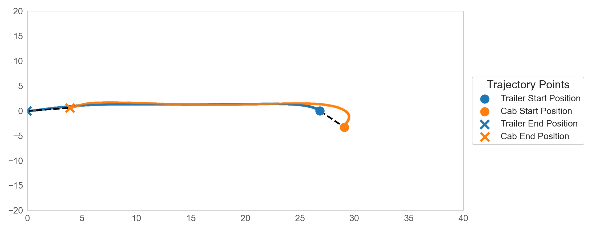
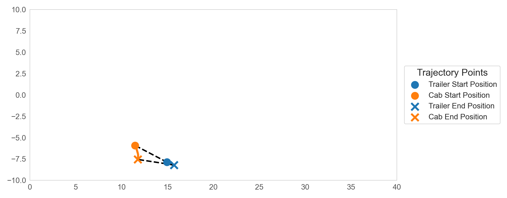
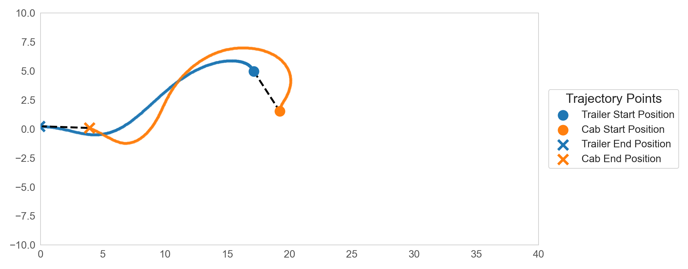
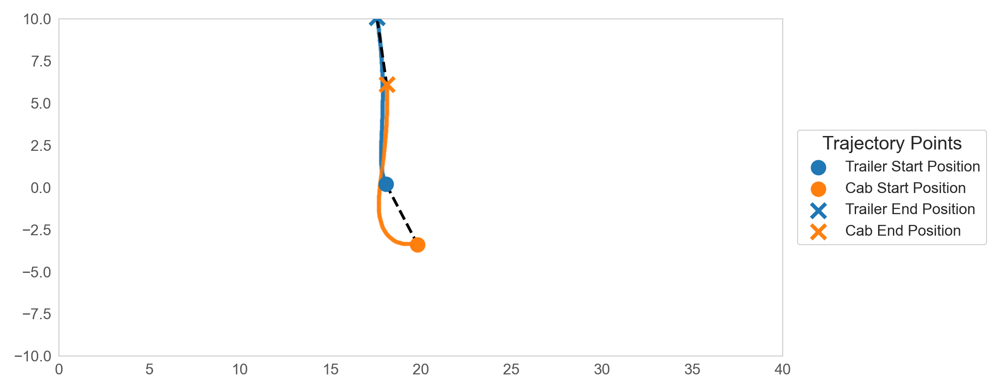
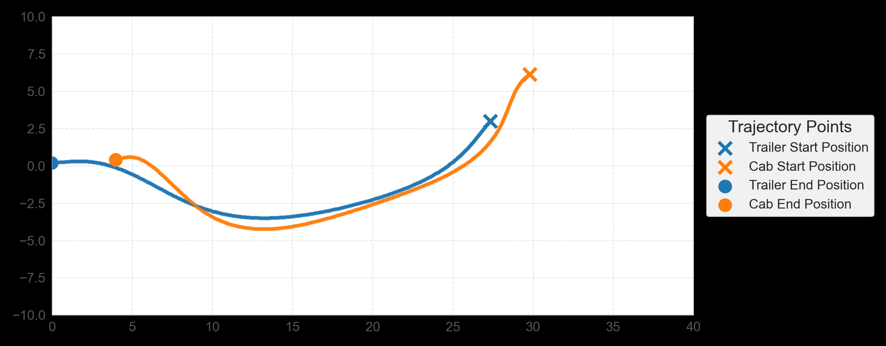
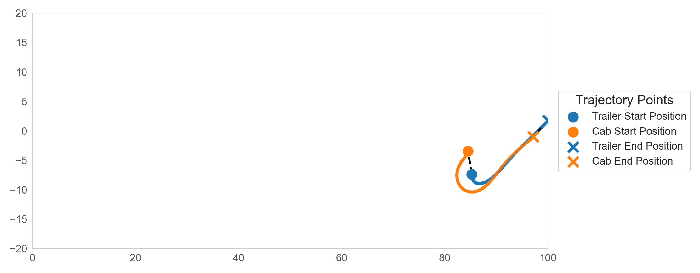
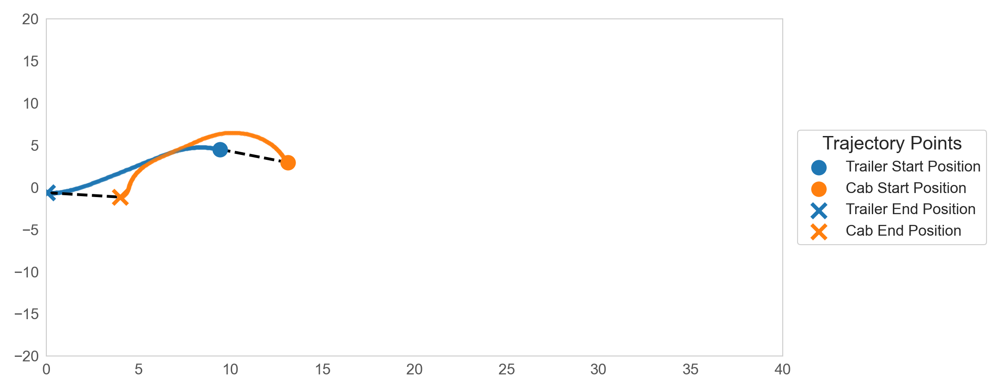
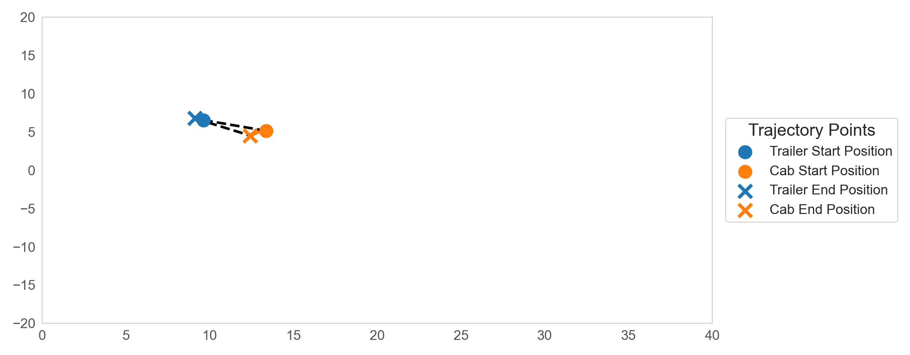
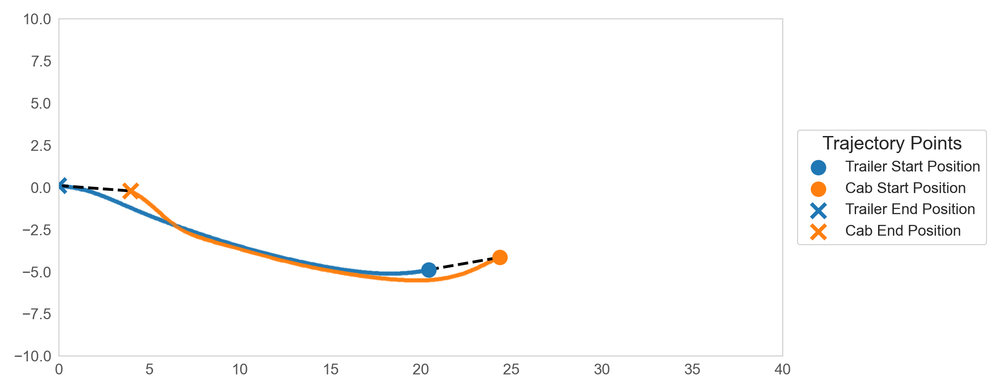

# Truck Backer Upper 

## Simulation Before Training 


## Simulation After Training


## Simulation Beyond Training Boundaries


## First 5 Trajectories




















## Run the Simulation

Create and activate the conda environment with:

```bash
conda env create -f conda_env.yaml
``` 

```bash
conda activate truck_backer_upper
```

To train models, run:

```bash
python truck-backer-upper.py \
    --train_test train \
    --final_cab_angle_range -120 120 \
    --final_cab_trailer_angle_diff_range -45 45 \
    --final_x_cab_range 10 35 \
    --final_y_cab_range -7 7 \
    --env_x_range 0 40 \
    --env_y_range -10 10 \
    --num_lessons 10 \
    --truck_speed -0.1 \
    --wandb_log False \
    --save_computational_graph False 
```

To test the models, run:

```bash
python truck-backer-upper.py \
    --train_test test \
    --final_cab_angle_range -120 120 \
    --final_cab_trailer_angle_diff_range -45 45 \
    --final_x_cab_range 10 35 \
    --final_y_cab_range -7 7 \
    --env_x_range 0 40 \
    --env_y_range -10 10 \
    --draw_trajectory True \
    --truck_speed -0.1 \
```