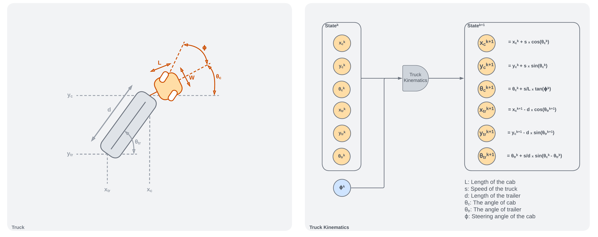

## Truck Kinematics 



## Training Emulator 


## Training Controller


## Simulation Before Training 


## Simulation After Training


## Trajectories


## Run the Simulation

Install `gifscale` to generate GIFs (Optinal). 

```bash
brew install gifsicle
```

Create and activate the conda environment with:

```bash
conda env create -f conda_env.yaml
```

```bash
conda activate truck_backer_upper
```

To test the models inside the training region, run:

```bash
python truck-backer-upper.py
```
To test the models outside the training region, run:

```bash
python truck-backer-upper.py\
    --env_x_range 0 100\
    --env_y_range -30 30\
    --test_x_cab_range 10 90\
    --test_y_cab_range -20 20
```

To train both emulator and controller models, run:

```bash
python truck-backer-upper.py --train_emulator True 
```

To train only controller models, run:

```bash
python truck-backer-upper.py --train_controller True 
```