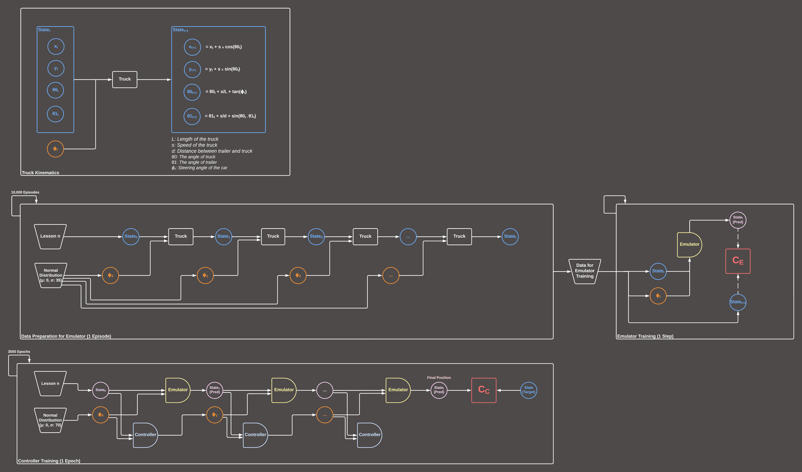

# Truck Backer Upper 

## Simulation Before Training 

## Simulation After Training

## Simulation Beyond Training Boundaries

## Training Process 

## Updates 

- There is no manual process in the notebook anymore.
  - Lessons are now created automatically instead of manually. All we need to do is to specify the number of lessons, the first lesson configuration, and the last lesson configuration. After this, lessons will be created automatically.
  - Previously, I was specifying the maximum number of steps (max_steps) the truck is allowed to take manually. And I was doing this for each lesson separately. Now, I use a fixed number of max_steps for all lessons and it seems like it is working.
- Stopping condition checks are not being tracked by autodiff anymore.
- The notebook is more clean now.
  - The reset() function in the Truck class is updated to reduce redundant code.
  - A new update_state() function is created in the Truck class. During the training of the controller, the state of the truck is now updated with this function.
- I added visualizations of gradients and loss values to Wandb instead of tracking them in Tensorboard and in the notebook. They can be seen in the links below:
  - [Emulator Training](https://api.wandb.ai/links/furkanozyurt21/ciflisl6)
  - [Controller Training](https://api.wandb.ai/links/furkanozyurt21/hgxga7y0)
- I visualized the computational graph for the controller. The visualization of computatinal graph can be seen in `computational-graphs` folder and the visualization of the training process can be found in `figures` folder.

## Notes
- The version of the Python that is used in this notebook is 3.10.15. 
- The truck is still not able to back up when it is initialized in horizontal and reverse positions unless we use the configuration below as a trick:
  - `self.θ0 = min(self.θ0 - self.θ1, deg2rad(80)) + self.θ1`
  - `self.θ0 = max(self.θ0 - self.θ1, deg2rad(-80)) + self.θ1`
