**Note**: This project was developed as part of a challenge project suggested by Dr. Alfredo Canziani in my Deep Learning course at New York University. I took the initial code that sets up a simulated environment, an agent (truck), and the agent’s dynamics within the environment from [here](https://github.com/Atcold/NYU-DLSP20/blob/master/14-truck_backer_upper.ipynb). I designed/developed the training process and built two models that learn to back up the agent to the target position from any initial point on their own. The training process, the agent's behavior before and after the training, and the instructions for how to run the code are explained below.

## Truck Kinematics 


## Training Emulator 


## Training Controller


## Simulation Before Training 

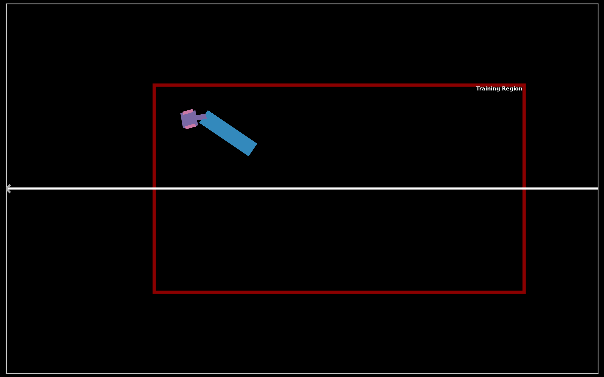

## Simulation After Training


## Simulation Beyond Training Boundaries


## Trajectories

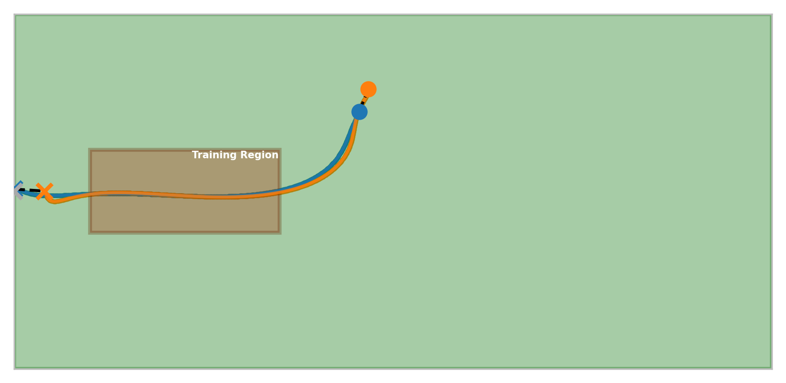

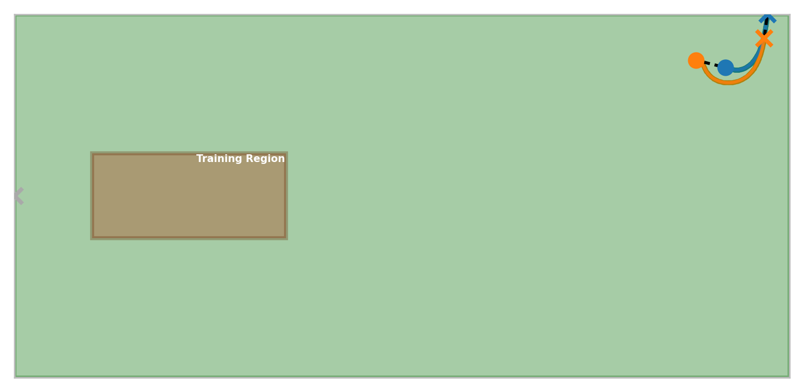

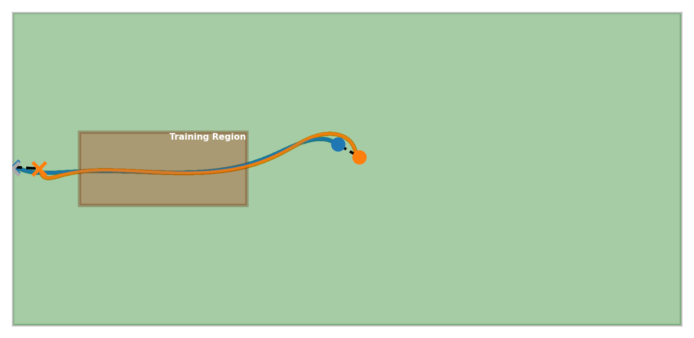

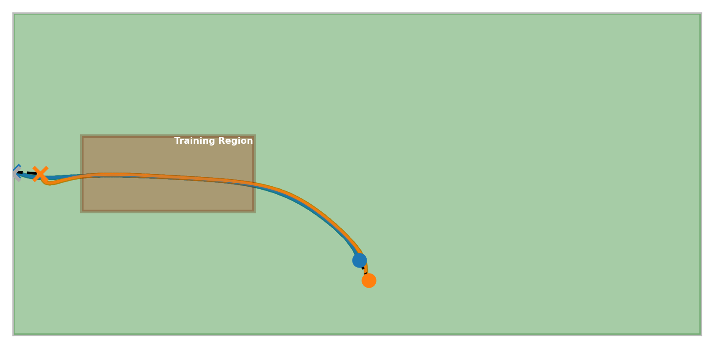

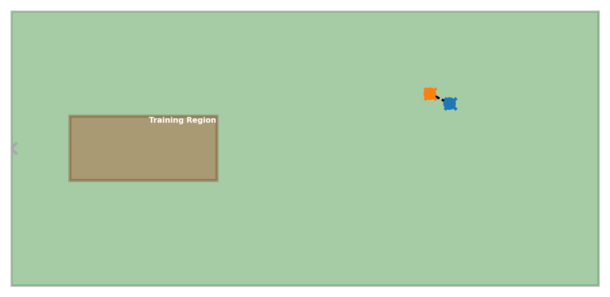

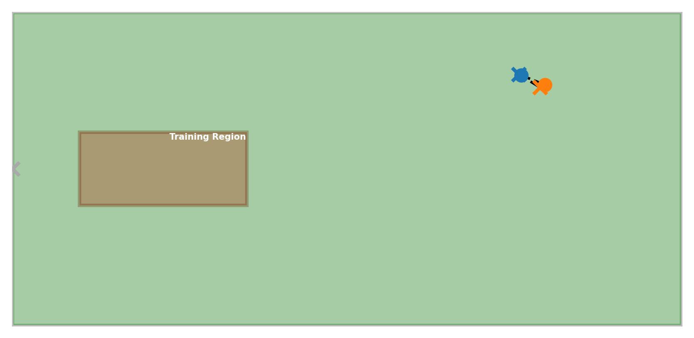

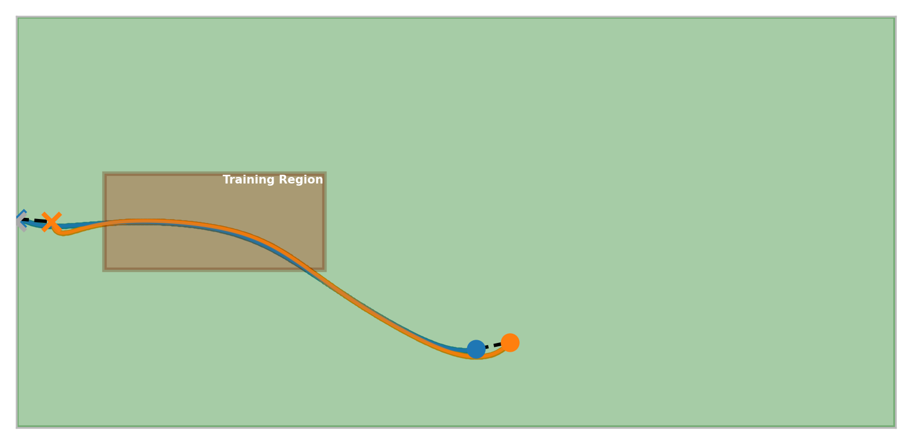

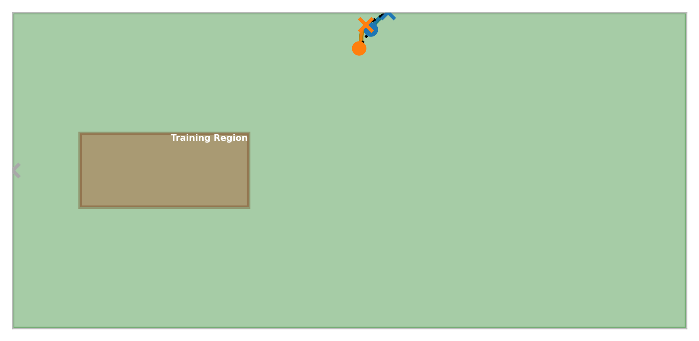

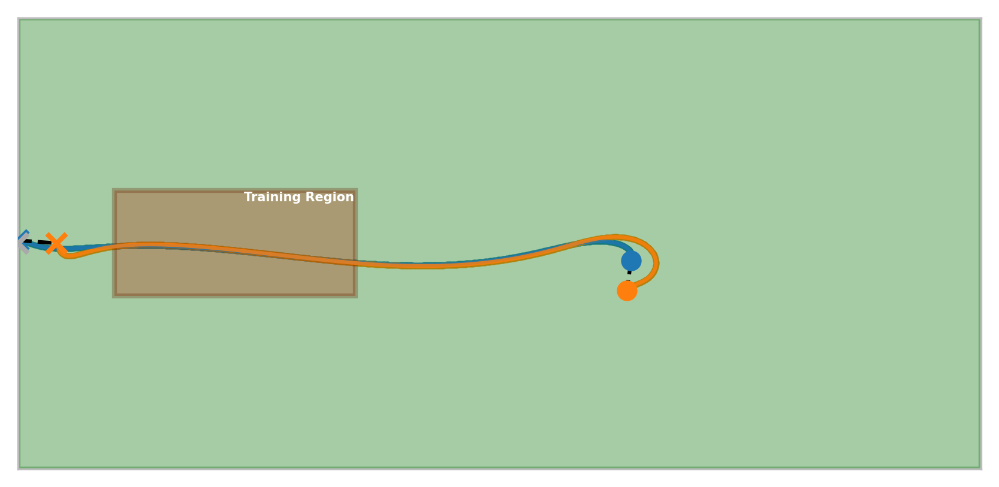

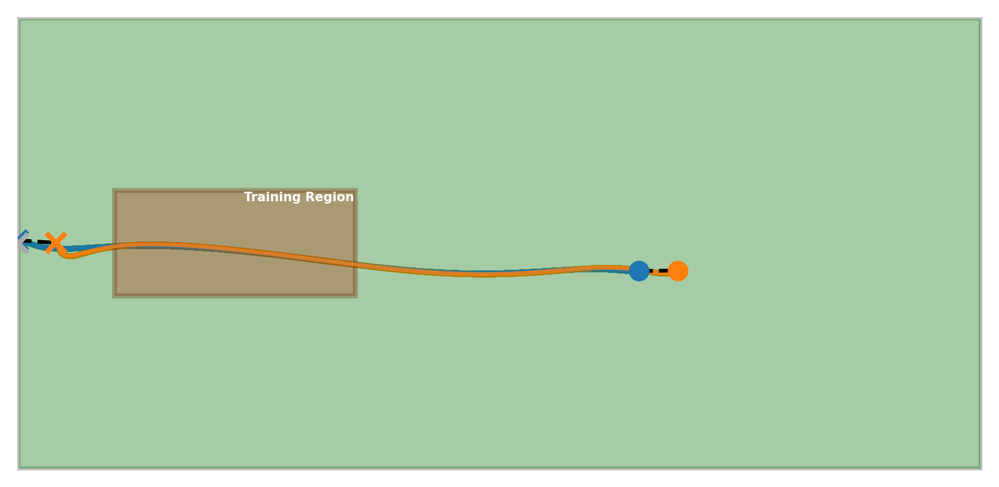

## Run the Simulation

Create and activate the conda environment with:

```bash
conda env create -f conda_env.yaml
```

```bash
conda activate truck_backer_upper
```

To test the models inside the training region, run:

```bash
python truck-backer-upper.py
```
To test the models outside the training region, run:

```bash
python truck-backer-upper.py\
    --env_x_range 0 100\
    --env_y_range -30 30\
    --test_x_cab_range 40 90\
    --test_y_cab_range -25 25
```

To train both emulator and controller models, run:

```bash
python truck-backer-upper.py --train_emulator True 
```

To train only controller models, run:

```bash
python truck-backer-upper.py --train_controller True 
```
# References

- Nguyen, D., & Widrow, B. (1989). *The truck backer-upper: an example of self-learning in neural networks*. In International 1989 Joint Conference on Neural Networks (pp. 357–363, vol. 2). [https://doi.org/10.1109/IJCNN.1989.118723](https://doi.org/10.1109/IJCNN.1989.118723)

- Schoenauer, M., & Ronald, E. (1994). *Neuro-genetic truck backer-upper controller*. In Proceedings of the First IEEE Conference on Evolutionary Computation. IEEE World Congress on Computational Intelligence (pp. 720–723, vol. 2). [https://doi.org/10.1109/ICEC.1994.349969](https://doi.org/10.1109/ICEC.1994.349969)
