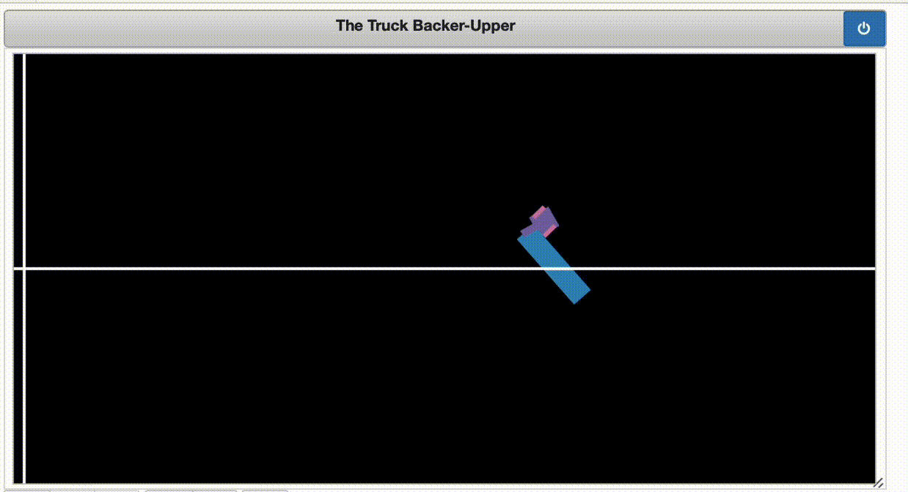
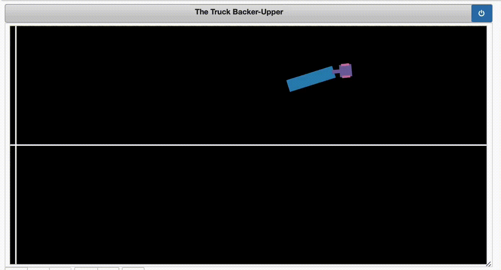

## Truck Backer Upper

### Situation 

In this project, there is a simulation of a truck and an environment. The truck can only move backward, and its moving speed is fixed. Therefore, the only variable that affects the position of the truck is the steering angle. Every time we specify a steering angle, the truck moves one step backward based on this angle.

The truck is initialized to different positions in the environment randomly, and the goal is to back up the truck to the target position properly, no matter where it is initialized. However, there are some challenges.

### Task

For instance, let's say the truck is initialized to a random position. In that position, we can use an infinite number of steering angles between 0 and 360 degrees, and the new position of the truck will be different with each one of these angles. After we pick a steering angle and the truck moves backward according to it, there will again be an infinite number of routes it can follow to reach the target position. Each step essentially creates an infinitely large solution space, which is one of the other challenges that need to be resolved.

In addition, the angle between the head of the truck and the trailer should not exceed 90 degrees at any time; otherwise, this would violate the laws of physics. Thus, another issue is to ensure that the angle between the head of the truck and the trailer is always less than 90 degrees from the first position to the last position of the truck.

Furthermore, even if the truck learns how to back up from a specific location, it has to generalize this knowledge across all kinds of different locations and positions. Also, there are many different routes to follow to back up the truck from one location to the target location. The goal should be to find the shortest possible path.

Another major problem is that there is no data available to make the truck aware of the consequences of its actions. That's why the truck has to be able to figure out many things on its own.

These are the main challenges that needed to be solved in the project.

####  Simulation Before Training

### Action

As humans, we can do a vast majority of things such as walking from one location to another, sitting down, or moving our arms and hands in a certain way to eat because the internal representation of the world in our brains is aware of the consequences of these actions. We learn these skills by performing actions and observing the results.

For this project, I prepared a similar system by creating a list of random steering angles, developing a feed-forward neural network model, and teaching this model the effects of moving backward with these steering angles. This model is called the emulator. At the end of the training process, it could accurately predict the new position of the truck for various steering angles. In other words, it became aware of the consequences of the truck's actions before those actions were taken.

After preparing the model that understands the consequences of the truck's actions in different locations, the next step was to solve the remaining problems.

In the next step, I developed another model similar to a recurrent neural network. This model is called controller because it controls the next position of the truck. 

Just like instructors start with simple concepts when teaching a new topic to ensure students grasp the fundamentals before moving to more complex ideas, I started the training process by initializing the truck in positions very close to the target location. The goal was to teach the truck how to back up from very short distances and gradually build on top of this knowledge.

In addition, I prepared a custom loss function since the traditional loss functions were not solving some of the problems that I mentioned in the first part. This loss function can be defined like the one below.

$L(x, y, \theta_1, \theta_0, \text{step}) = -\log\left(\frac{1}{P_1 \cdot P_2}\right)$

$P_1 = x^+ + |y| + M_{\theta_1}$

$P_2 = (x^+)^2 + y^2 + M_{\theta_1}^2 + A^2 + 0.01 \cdot \text{step}$

$M_{\theta_1} = \min(|\theta_1|, ||\theta_1| - 2\pi|)$

$A = \max\left(0, \frac{\text{deg}(|\theta_1 - \theta_0|) - 30}{30}\right)$

$x^+ = \max(0, x)$

In the loss function above, $x$ and $y$ represent the coordinates of the trailer of the truck. The target position to which the truck should be backed up is (0,0). Therefore, the squared distance between $(x,y)$ and $(0,0)$ is used in the loss function. $\theta_1$ represents the angle of the trailer while $\theta_0$ represents the angle of the head of the truck. In its last location, we want the trailer to be in a horizontal position. In other words, the ideal value of $\theta_1$ is 0, 360 degrees, or -360 degrees, which are essentially the same. 

Note that if $\theta_1$ is 280 degrees or 80 degrees in its last location, for example, they are equivalent. Similarly, if $\theta_1$ is 20 degrees or 340 degrees in its last location, they are equivalent as well. Therefore, I take the square of the minimum of $\theta_1$ and $\theta_1 - 2\pi$, square this value, and use it in the loss function. 

Additionally, we mentioned that there are many different ways to back up the truck from a specific location. However, we want to find the shortest path. That's why I added $0.01 \times \text{step}$ to the loss function to penalize the number of steps taken to back up the truck. 

We also mentioned that the angle between the head of the truck and the trailer should not exceed 90 degrees. To ensure that the truck does not have an angle greater than 90 degrees between its head and trailer, I penalized the difference between the head of the truck and the trailer once this angle exceeds 30 degrees.

All of these factors are considered in the $P_2$ part. 

$P_2$ was my first loss function. However, even when the model was finding the shortest path and the truck was backed up to the correct position, the loss value was still relatively high due to the number of steps taken. To address this issue, I multiplied $P_2$ by $P_1$. This means that if the truck is at the correct position (x = 0, y = 0, and $\theta_1$ = 0), the loss value will be 0 because the sum of $(x, y, $\theta_1)$, which will be 0 in the target location, is multiplied with $P_2$." 

Finally, to scale the loss values and prevent them from being very far apart, I calculate the negative log of $-1/(P1 \times P2)$. This will help us obtain a more uniform loss values.

After prearing the loss function, the next step is to train the controller that will decide the list of steering angles the truck should use step by step to back up to the right location. 

When the truck is initialized to a random position and makes steps, the next time it chooses a new steering angle, the model considers all previous actions that were taken until that point when selecting the new steering angle. 

### Results

#### Simulation After Training

### References
