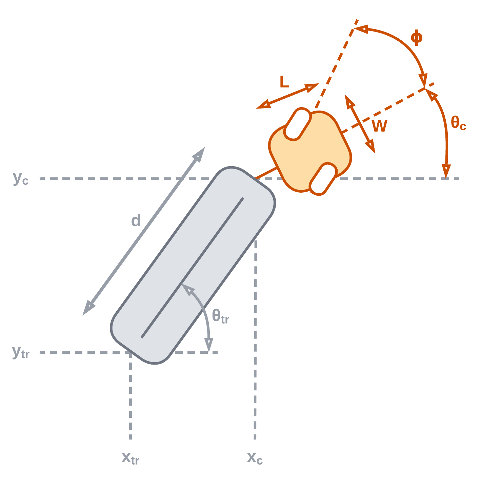
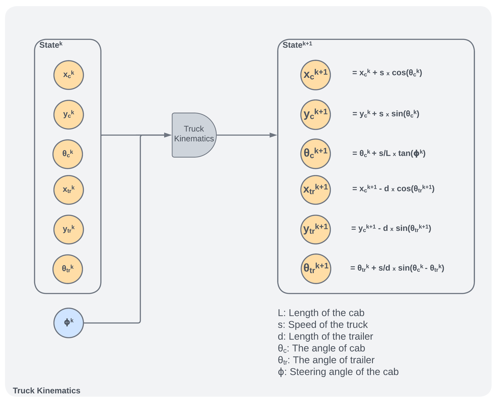
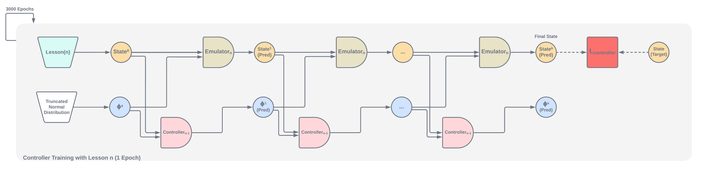

# Truck Backer Upper 

## Truck Kinematics 





## Training Emulator 


## Training Controller




## Simulation Before Training 


## Simulation After Training


## Simulation Beyond Training Boundaries


## First 10 Trajectories


## Run the Simulation

Create and activate the conda environment with:

```bash
conda env create -f conda_env.yaml
``` 

```bash
conda activate truck_backer_upper
```

To test the models inside the training region, run:

```bash
python truck-backer-upper.py
```
To test the models outside the training region, run:

```bash
python truck-backer-upper.py\
    --test_x_cab_range 70 90\
    --test_y_cab_range -15 15\
    --env_x_range 0 100
```


To train both emulator and controller models, run:

```bash
python truck-backer-upper.py\
    --train_emulator True 
```

To train only controller models, run:

```bash
python truck-backer-upper.py\
    --train_controller True 
```